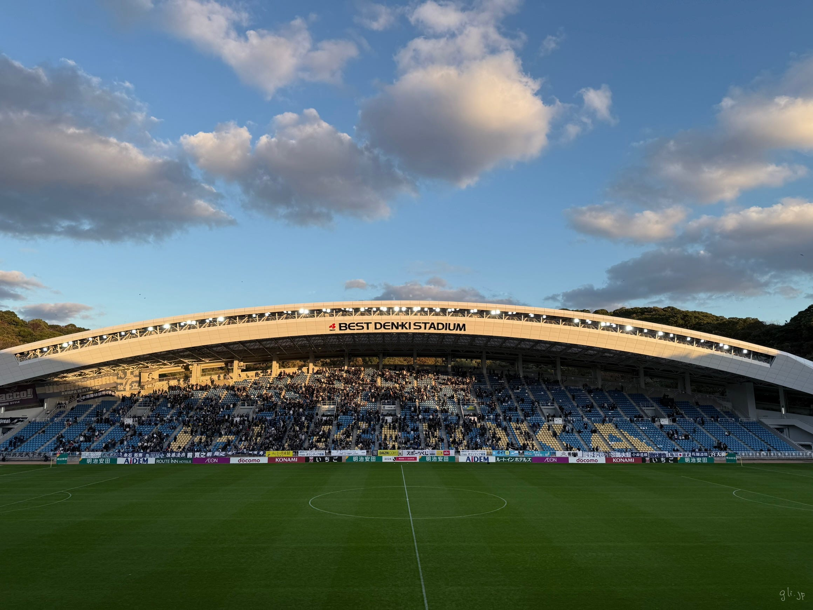

久しぶりに実家に帰省した。前回の帰省の時は、マスクつけてたり、自分が媒介して両親に感染させてしまわないかとても不安だったのを覚えている。久しぶりに帰省した実家は、長いこと畑だった場所が住宅地になっていたりと、街も変化しているようだった。

実家に帰るために飛行機を利用した。飛行機を利用するのも1年ぶり。今回はMarshall MONITOR III ANC が相棒だ。結論からいえば、ノイズキャンセル性能は機内で音楽を楽しむのに十分だった。発着時でもBluetoothを使うことが許可されるようになってからは、飛行機の座席に座って、離陸後立ち上がるまでずっとヘッドフォンをつけていることが多い。はっきりと確認していないが、iPhoneを機内Wi-Fiに繋げていると、ストリーミングもできているようだ。

実家の目的は、アビスパ福岡のホーム最終戦だった。ほぼ1年ぶりのホームスタジアム。このスタジアムにしては非常に多くの人が詰めかけた試合だった。自分の見ている限りでは大きな混乱はないようだった。自分が知っている限り動線が整理されているように感じた。なによりスタジアム全体が試合の内容にひとつひとつ反応しているのが楽しかった。

福岡市営地下鉄はクレカタッチ決済に対応しているし、JR九州も対応していたが、対応している改札が限定されているのは少し気になった。自分が普段住んでいる街では、切符を受け付ける改札が限定されていて、切符を持っている人が自分の番になって初めてそのことを認識し、戸惑っている様子をたまに見かける。クレカタッチ決済も同様の戸惑いが発生しないようになれば「はじめて」のハードルが下がり、「使ってみようかな」と思う人が増えるのではと思う。

脱線だが、松本でバスに乗った時、クレカ決済にチャレンジしたのだが、降りる時に非接触決済端末がいくつも並んでいて戸惑ったのを思い出した。

そろそろまだ行ったことないところにも行ってみたいなと思っている。意識が外に向き始めているのを感じる。