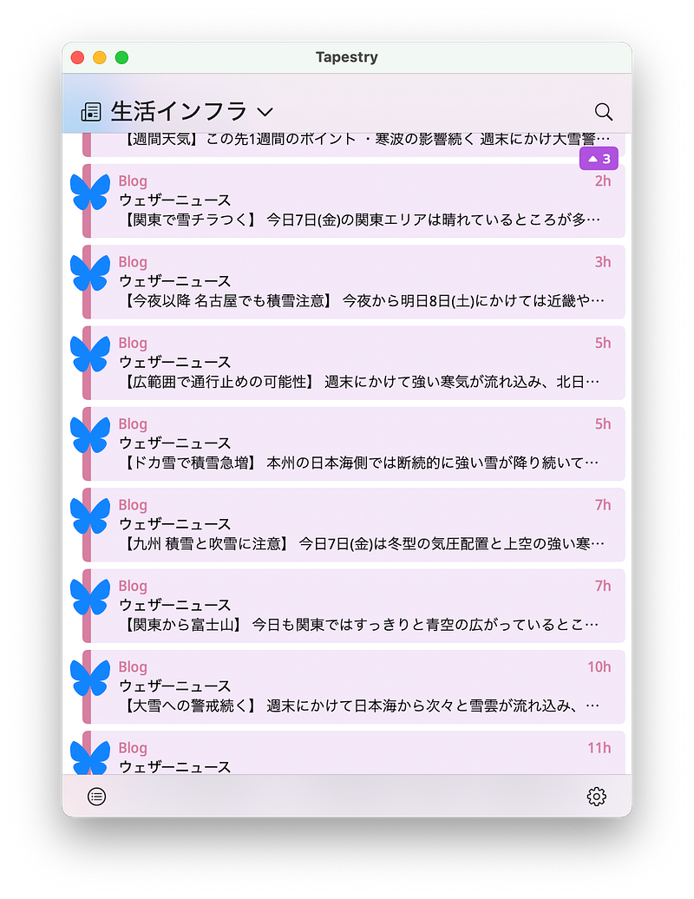

さまざまなメディアからやってくる情報、どのように入手しているでしょうか。Twitterのユーザーが増えていた頃、”Twitterで読めばいいから、RSSリーダーは使うのをやめた”というコメントを見かけることがありました。その後、TwitterがXになり、環境が変わっていく中で、情報を入手するスタンダードな方法がなくなってきたように感じます。

自分はずっとFeedlyを使い続けています。最初に使うときにProライセンスをLifetimeで購入しているので、サービスが継続する限りは使い続けるだろうと思います。Feed、つまりRSSは自分の中でいまだに最も使いやすいと思っています。

ところが、新しいサイトではFeedをサポートしていないことも多く残念です。「Web巡回」をするのも大変なので、ここもFeedlyに頼っています。FeedlyにはRSSビルダーといって、サイトの構造を読み取ってRSSっぽく使うことができる機能があって、それを使って更新を受け取っているサイトもありますし、はてなアンテナを使って更新情報の通知だけ受け取るようにしているものもあります。

そんな中、世界初のTwitterアプリを作ったIconfactoryから新しいアプリTapestryが登場しました。[Kickstarterに出ていて](https://www.kickstarter.com/projects/iconfactory/project-tapestry/)、自分もサポートしつつ、リリース前のバージョンを使っていたのですが、正式リリースされたということなので、このタイミングで紹介したいと思います。

[**Tapestry**  
_Tapestry - Weaving your favorite blogs, social media, and more into a unified and chronological timeline._usetapestry.com](https://usetapestry.com "https://usetapestry.com")

Tapestryは、さまざまなサイトの更新情報を検知して、Twitterのタイムラインのように並べてくれるアプリです。もちろん、RSSも対応していますし、YouTubeやBlueskyなどにも対応しています。外部サービスにはConnectorというものを介してアクセスするようになっています。Connectorは自作のものを追加できるようになっています。開発陣が英語圏にいることが影響してか、標準で用意されているConnectorは英語圏でよく使われているもの(Redditとか)が多いので、日本語圏用にConnectorを作る必要はあるかもしれません。

サービスごとにアイテムの色を設定できます。たとえば更新を逃したくないサービスだけを赤色に設定しておいて視覚的に判断する、というのも便利かもしれません。また、特定のアイテムだけを表示するタイムラインというものも作れます。エンジニアの場合は、AWSとか使ってるサービスの稼働状況のFeedを登録しておいて、その状況確認に使うこともできると思います。

あくまでアプリで、リリースのバージョンではウィジェットもありません。バックグラウンドで更新して通知してくれるわけではないあたりが厳しいですが、初期のTwitterrificのように新しい更新があれば「ピーチクパーチク」鳴いてくれると嬉しいなと思います。

昨年9月に完全リニューアルしたReederもTapestryと似たような、更新通知アプリです。

[**Reeder**  
_News Reader. Rebuilt for Today._reederapp.com](https://reederapp.com "https://reederapp.com")

新しいReederについては、[lifehacking.jp](https://lifehacking.jp) にて記事になっていたのでそちらを読んでいただくとよいと思います。

[**新Reederは未読数を忘れて情報の流れを受け取るRSSリーダーの再発明**  
_macOS / iOS / iPadOS 上でとても人気のある RSS リーダー、"Reeder" に大きなアップデートがやってきました。 RSS…_lifehacking.jp](https://lifehacking.jp/2024/09/new-reeder/ "https://lifehacking.jp/2024/09/new-reeder/")

“更新通知界隈”がどれくらい盛り上がるかは未知数で、一般的に使われるようになるのかまだわかりませんが、情報感度が高い人たちにはこういうものもあるというのを知っておくといいかもしれません。