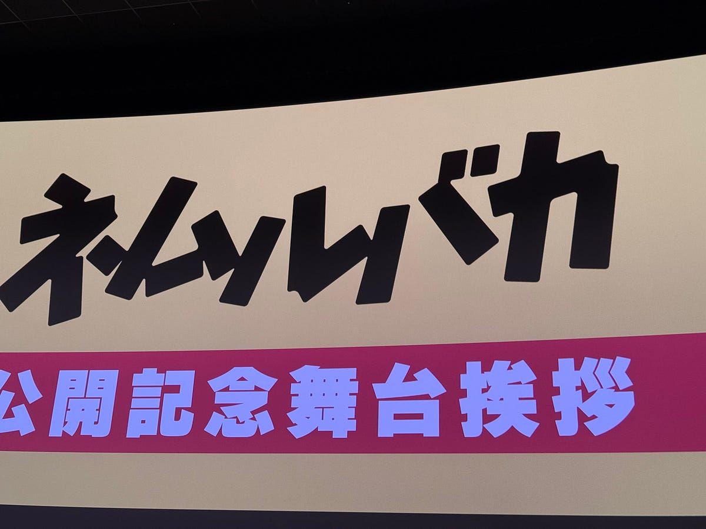

「ネムルバカ」を早速見てきました。漫画原作ですが、いつものように漫画の存在は知らず、乃木坂46ANN の中で久保史緒里さんが宣伝していたのを聞いたのが映画の存在を知った最初だったと思います。阪元監督がベビわるではない形でシスターフッドの映画を撮る、しかも音楽映画らしいということで、見るしかないと思って見てきました。

公開初日に空いてる時間があったのでそこで見てもよかったのですが、舞台挨拶付きの回が運よく当たったのでそちらに。乃木坂46のファンが多いのかなと思ってたんですが、共演してた男性俳優の方のファンが多かったみたいですね。

さて、ここから作品の内容に触れていきます。これ以上情報を仕入れたくないよという方はぜひ「後で読む」的なサービスに入れておいて、映画見終わったら帰ってきてください。

「ネムルバカ」にはいろんな要素がギュッと詰まっていました。中でも、入巣柚実を中心とした大学生の女子寮の堕落した生活と、鯨井ルカを中心とした自己実現の物語。この2つが大きな柱かなと思います。

女子寮の生活シーンは、それこそ坂元監督がベビわるでも見せた、ゆったりとした時間が流れるシーンで、ちょっとクスッと笑ったり、思わず共感したりしちゃうんですよね。

入巣柚実を演じるのは、現役アイドルで大河ドラマにも出た久保史緒里さんですが、あんな堕落した演技や酔っ払った演技、なんであんなに自然なんですかね。

鯨井ルカを中心とした自己実現パートは、音楽の中でもRockで育ってきた人間にはグッと刺さるものがありました。ライブハウスの熱狂をきちんと映し出したことで、後々のシーンの感情につながっている気がします。

自己実現の青春ものには、「自分のやりたいことか社会の歯車になるか葛藤しながら選ぶ」という筋書きが必ずあります。今回もおおまかに言えばその筋書きなのですが、鯨井ルカが葛藤している様子を描かず、突然ポップアイコンになったことで、「まさか」な展開につながっていく。自分は、タイトルが出るシーンがとても好きです。

そしてそれと同時に、エンディングのシーンもとても好きです。