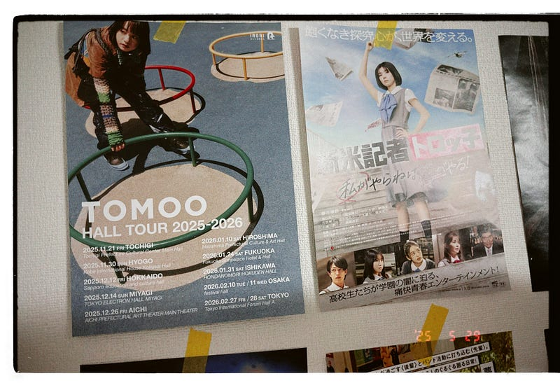

映画館に行くときには、A4サイズの紙が入るファイルを持っていくようになった。置いてあるチラシの中から気になる作品があれば持ち帰り、自宅の壁に貼る。リマインダーとしての意味もあるが、インテリアとしても楽しんでいる。こういう表現はあまり好まないが、少し先に公開される映画のチラシが、日々に小さな意味や希望を与えてくれるように感じる。

少し話題が変わるが、TOMOO HALL TOUR 2025–2026が発表された。東京公演は2026年2月27日、2月28日の2 Days。来年の節分付近に思いを馳せる。その頃、ここに住んでいるだろうか、何をしているだろうか、人生は思いもよらない小さなきっかけで変わることがある。

このツアーが発表されたのは2025年5月23日、日本武道館でのことだった。発表を現地で受け取った。初めて参加したTOMOOのライブでは、管楽器と弦楽器の生音が空間を優しく包んでいた。最近よく参加しているライブでは、追加の演奏者をいれず、コンピュータで音を鳴らしていることが多い。それだけに久しぶりに生音だけに包まれた空間は、それはとても贅沢な音楽空間だった。

[**【ライブレポート】TOMOOが初武道館公演で作り出した"透明な器"「曲の向こうには人がいますから」（写真10枚）**  
_TOMOOのワンマンライブ「TOMOO Live at 日本武道館」が5月23日に東京・日本武道館で行われた。_natalie.mu](https://natalie.mu/music/news/625418 "https://natalie.mu/music/news/625418")

TOMOO at 日本武道館が発表されたのは2024年12月13日([https://natalie.mu/music/news/603669](https://natalie.mu/music/news/603669))。その少し前、夏フェスでTOMOOの音楽にダイレクトに触れ、そろそろTOMOOのワンマンも行ってみたいなと思っていた頃だった。もちろん人気のあるミュージシャンである。日本武道館のチケットはそう簡単に手に入らなかった。 きっと直前に機材席が開放されるはず。そう思って粘ろうとしていたところ、チケットトレードのお知らせが届いた。櫻坂46でも同じチケットトレードのシステムだが、取れたことはない。ダメもとでチャレンジしてみることにした。

数日後、「チケット当選の連絡」という通知が届いた。そして日本武道館で楽しい夜を過ごした。ライブに参加する時にいつも見てるのは、どんな人たちがこのライブに来ているのかということ。TOMOOのライブにはさまざまな年齢層の人たちが参加していた。最新の音楽に詳しそうな若い人たち。仕事を切り上げてきただろう人たち。この時間を楽しみに待っていた年を重ねたカップル。生音に包まれた空間と相待って、音楽の豊かさを体感できた気がする。大学生くらいの若い人たちが多い勢いがあるライブに参加することが多かったから余計に。

次に参加するとすれば、2026年2月27日。2024年12月13日から数えて442日後だ。そのとき、自分はどこで、何をしているのだろう。