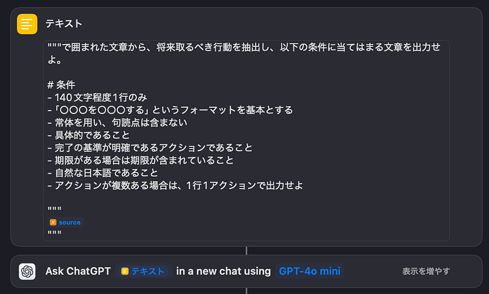

前回のブログでは、久しぶりにOmniFocusの使い方についてまとめました。しかし、そこでは書ききれなかったこぼれ話があります。今回はそれを取り上げたいと思います。

一時的な情報の保管場所として「INBOX」を置いておいて、Weekly ReviewのときにOmniFocusの「INBOX」に投げ込むという仕組みがあります。INBOXはさまざまな形で複数用意されていて、どんな状況でもすぐに使えるように用意しています。

受け取った郵便物や紙切れをとりあえず入れておく物理INBOX、作業が必要なメールを溜めておくINBOX、コミュニケーションのツールでも作業しないといけないものに紐づくアイテムを入れておくためのINBOXなど。自分は、メールではフラグをつける、Slackでは「あとで」を使う、などを使っています。それを定期的に全部チェックして、OmniFocusに入れていくわけです。

受け取ったメールを読み、すべき作業を見つけ出し、OmniFocusに入れるという作業は、文章を理解しアクションを抽出する作業で、決して単純作業ではありません。これを楽にしたいなと思い、ChatGPTを使ったらどうなるか、試してみることにしました。

ChatGPTはチャットUIを使ってさまざまなリクエストを送ることができます。しかし、プロンプトを毎回書いているのは面倒なので、macOS/iOS/iPadOSのショートカットを使って実装しています。

Web版ChatGPTはブラウザなので連携が難しいですが、アプリ版はショートカットに対応しているため、テキストを放り投げるだけでOmniFocusのアクションを作ってINBOXに入れておいてくれるショートカットを作ることができました。

今年のどこかにはApple Intelligenceが日本語に対応することになっています。日本語に対応し、ショートカットに対応するようであれば、ChatGPTの部分をApple Intelligenceに差し替える予定です。オフラインで作業できた方が早くて便利ですから。