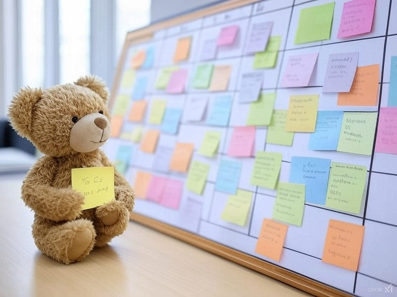

OmniFocusについてよく書いているが、実はThingsの方が好きだ。Thingsはタッチパネルネイティブなアプリで、OmniFocusはキーボードネイティブなアプリだと感じている。手書きの使いやすさも加えて、iPadでの操作性はとてもよい。

そんなThingsだが、タグの使い方に悩んでいた。OmniFocusではタグとしてアプリ名や店舗名を入れることが多い。タグを何のために使うかというと、後でフィルタリングするためだ。Thingsで具体的な名称をタグに使ってしまうと、少々困ったことが起きる。

例えば、順番に処理しなければならない3つのアクションがあるとする。それぞれに別のタグ、タグ1、タグ2、タグ3がついているとする。そういう状況が生まれたとする。タグでフィルタリングすれば、これらのアクションのうち1つに絞り込まれるだろう。しかしThingsは順番に処理しなければいけないことをアプリの上で表現できない。つまり絞り込まれたアクションはまだ実行できない可能性がある。OmniFocusでは、アプリ上で順番に処理しなければいけないことを明示できる。別のアクションを完了待ちしているアクションはそもそもフィルタリングしても出てこないのだ。

Thingsでは、どのようなタグを使うべきか。3つのタグの共通項を見つけて、それをタグにするほかない。「どこでも」を見ていれば、細かい絞り込みをする必要はないのだ。

OmniFocusで店舗名をタグとして設定する理由は単純だ。タグに位置情報をつけ、その場所が近くにあれば、紐付いたアクションを表示するようにできる。なぜそのような機能があるかと言うと、OmniFocusではちょっと時間ができたときに、アクションを探して実行する目的のために作られているからだ。 例えば仕事で銀座に立ち寄り、その場で仕事が終わってしまった、もしくは就業時間が終わってしまった。そのまま帰るのも味気ないので、ついでに用事を済ませようと思うことはよくある。 「ちょうどTシャツが欲しいと思ってたんだった。」 そのアクションが『無印良品』や『ユニクロ』に紐づいていれば、OmniFocusが現在地をもとに実行可能なことを教えてくれる。

Thingsの場合は、1日の始まりに、『どこでも』リストの中から実行したいアクションを『今日』のリストに移し、“今日何をすべきか”を計画する。状況変化があって仕事で銀座に立ち寄り、そのまま手が空いてしまったときに、「Tシャツを買う」ことが「今日」のリストに入っていない場合、それに対応できるような作りにはなっていない。もちろん、別に「買い物リスト」を作っておいて対応することはできる。

そもそものGTDの設計思想から言えば、OmniFocusの設計思想と近い。生まれる隙間時間を有効活用し、作業をすることで、効率を上げていく、というのがGTDのキモの部分だ。なので、個人的にはThingsをGTDアプリと紹介するつもりはない。1日の予定を立て、それに基づいて作業していくという流れが得意な人、それでうまく回る環境にいる場合にはとてもよいリマインダーアプリだと思う。

自分がThingsを使う場合、タグの設計は次のようにする。「仕事」のアクションか、「生活」のためのアクションか、「趣味」のアクションか、それがわかれば充分だと思う。例えば、とある動画コンテンツを見る場合に、それがYouTubeなのかAmazon Primeなのかはタグにしなくても自分ならわかるだろう。

