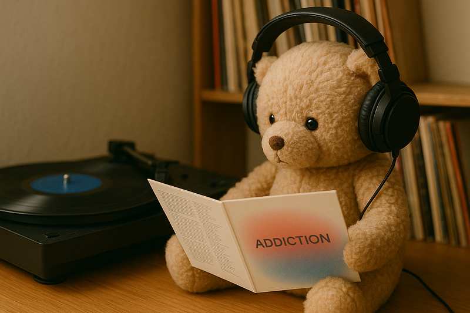

櫻坂46の2ndアルバム「Addiction」の収録内容が発表された。Interludeでシングル曲をつなぐ構成になっていて、Type-AにはRemixも入るらしい。ファンの間では、さっそくいろんな声が飛び交っていた。

その中でちょっと気になったのが、「もうアルバムをフルで聴く時代じゃないのでは？」というコメント。たしかに今は、SpotifyやApple Musicのようなストリーミングサービスが主流で、曲を単体で聴くことが前提になっている。特にSpotifyのように、次から次へとおすすめが流れてくるスタイルだと、曲単位の消費がさらに加速する感じがある。

でも、それでもアルバムという形を選ぶアーティストがいる。むしろ今だからこそ、アルバムでしかできない表現にこだわっている人たちがいる気がする。最近出会った作品たちを挙げてみる。

*   合歓る / Laura day romance
*   Dungeon / muque
*   our hope / 羊文学
*   THE PARK / 赤い公園

どれも、アルバムを通して聴くことで感じられる「世界観」があった。シャッフルでは見えてこない景色というか、一本の映画を観たような余韻が残る感じ。

ちなみに、自分はSpotifyとApple Musicを一時期併用していたけど、最終的にApple Musicに落ち着いた。理由は単純で、アルバムが聴きやすかったから。

最近では、しっかりアルバムを作り込むようなアーティストでも、「この後0時に新曲出ます」って突然告知したりする。そういうフットワークの軽さも含めて、ストリーミング時代ならではの面白さなんだろうなと思う。

櫻坂46の「Addiction」も、ひょっとしたら“ベスト盤”的な側面もあるのかもしれない。でも、Interludeという要素を入れてきたことで、また新しい見せ方をしようとしているのかもしれない。ライブでの表現力が強いグループだからこそ、音源でもどう世界観を提示するのか、楽しみに待ってみようと思う。