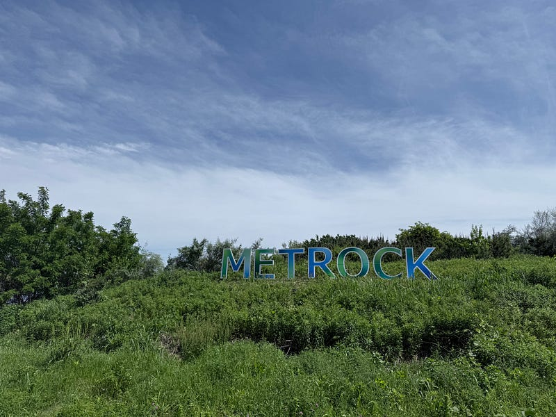

春フェスに行ってきた。音楽フェスといえば、夏のイメージも強かったが、この時期に開催される「春フェス」も定番化してきた。

フェスは見たいバンドが２、３組出ていたら行くようにしている。その日は、Laura day romance、Chilli Beans.、羊文学、muque と４組も出演する日で、行く以外の選択肢がなかった。行ったことがないフェスに参加してみたいという気持ちもあった。実質これがGWの最終日。

今年は海の森に場所を変えたMetrock2025は、都心からもアクセスがよかった。東京テレポート駅からシャトルバスが出ているのだが、自分の体験ではほぼ待つことなくスムーズに乗れた（他のフェスの経験を踏まえて1時間くらいは待つイメージをしていた）

目的のバンドが朝早かったり、同じステージの連続だったりしたので、長い待ち時間もあったが、他のステージから聞こえてくる音楽などを楽しみながら時間を過ごせた。海の森自体は、雑草が伸びまくっていた。ちょっと気になったけれど、こうしたイベントでの使用実績はまだ少ないと思うので、これから整備されていくのかもしれない。

屋外でもしっかりと音を聴かせてくれるLaura day romance。いつもよりテンション高かったChilli Beans.、ビシッと音を聴かせてくれて貫禄すら感じる羊文学、ステージのトリでテンション高かったmuque。4組とも素晴らしいステージアクトで、ワンマンよりもずっと短い持ち時間の中に、それぞれのバンドの色がギュッと詰まっていた。

最近の夏のフェスで感じるのは、日焼け止めを塗る人がいないこと。一昔前は一生懸命塗り直す人がいて、ひとつの風物詩のような感じになっていたが、その日はひとりも見かけなかった。多くの人の頑張りで、朝家で塗っていれば日中は気にしなくてもよくなった。その技術の進歩なんだろうと思います。

今年はRock’in Japan Fes (RIJF)も酷暑を避け秋に移動する。夏のフェスは酷暑との戦いになるが、春と秋は長雨との戦いになる。日本の気候の変化に合わせて、音楽フェスシーンも変わっていきそうだ。

