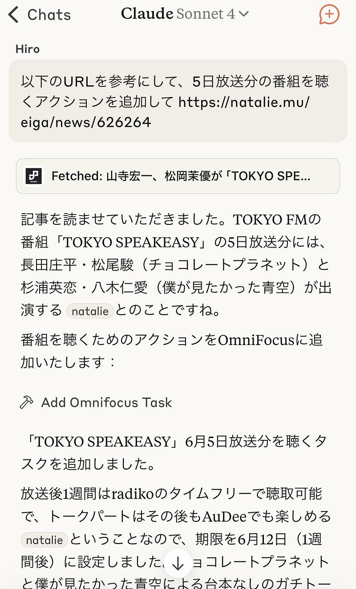

アイドルがキャッチコピーをChatGPTに聞いて考えたり、独り言に付き合ってもらったり、そんな感じで幅広い年代に使われていることがわかってきています。そんな中で、OmniFocusと生成AIを繋げることができる、OmniFocus MCPを見つけたので、ちょっと使ってみました。MCPというのは生成AIやサービスとアプリをつなげるための共通規格です。セキュリティの問題も指摘されており、個人的には広くおすすめはしません。今回はClaude Desktopに繋げる形で使っています。

[**GitHub - themotionmachine/OmniFocus-MCP: Claude's OmniFocus integration: Let LLMs interface with…**  
_Claude&#39;s OmniFocus integration: Let LLMs interface with your tasks through the Model Context Protocol. Add…_github.com](https://github.com/themotionmachine/OmniFocus-MCP "https://github.com/themotionmachine/OmniFocus-MCP")

OmniFocus MCPを使うとチャット形式で呼びかけながら、さまざまな操作ができます。新しいアクションを作ったり、今日やるアクションを探したり、重複しているアクションがないか探してもらったり。

自分のアクションのパターンのひとつとして、Webで知ったメディアの情報を”後で見る”のような形で使っているものがあります。聞きたいラジオ番組の情報をウェブで見つけたので、そのURLを添付し、「この番組の情報を追加して」と頼んでみたところ、自分でウェブの情報収集しアクションを追加してくれました。

これまで煩雑だった作業を楽にしてくれるOmniFocus MCPですが、ウィークリーレビューにも活用できたらいいなと思っています。ウィークリーレビューはアクションのデータベースであるOmniFocusと自分の頭を同期させる儀式。自分の頭の中から情報を引っ張り出す場面も多いので、生成AIですべてを自動化するのは難しさもあるかもしれません。ですが、たとえばメールを参照して未返信のものを見つけたり、カレンダーから来週の会議をチェックしたりする作業は、生成AIで十分に対応できます。ウィークリーレビューには、よく知られたトリガーリストがありますが、どれも一般化されていて抽象度が高いもの。生成AIを使って、より具体的なトリガーリストを作ることで、レビューの時間を濃いものにできるんじゃないかなと思います。

[**"実践"GTD週次レビューチェックリスト**  
_GTDの実践に欠かすことのできない「週次レビュー」。百式主宰の田口元氏が自らのチェックリストを紹介する。_www.itmedia.co.jp](https://www.itmedia.co.jp/bizid/articles/0608/09/news061.html "https://www.itmedia.co.jp/bizid/articles/0608/09/news061.html")

ソフトウェアエンジニアの界隈では、生成AIを使って自動的にコードを書いてもらったり、コードレビューの観点をまとめてもらったりといった活用が進んでいます。品質を確認する活動にもAIが取り入れられ、業務全体に生成AIの力を活かそうという動きが広がっています。ソフトウェアエンジニアリングの部門で働く雇用にも影響しようとしています。

生成AIは、アクションの管理においても非常に有効だと感じています。これまで手作業でやっていたり、ちょっと煩雑になっていた作業をシンプルに行えるようになるかなぁと思うので、書いてみました。

